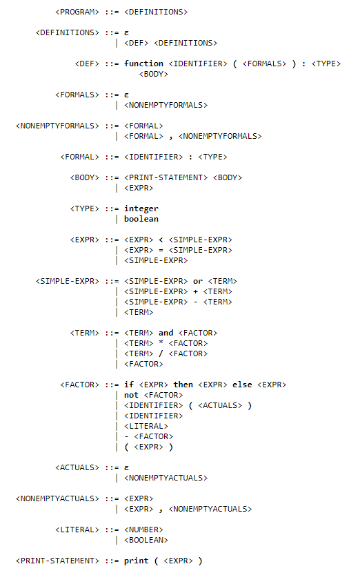
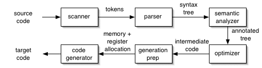
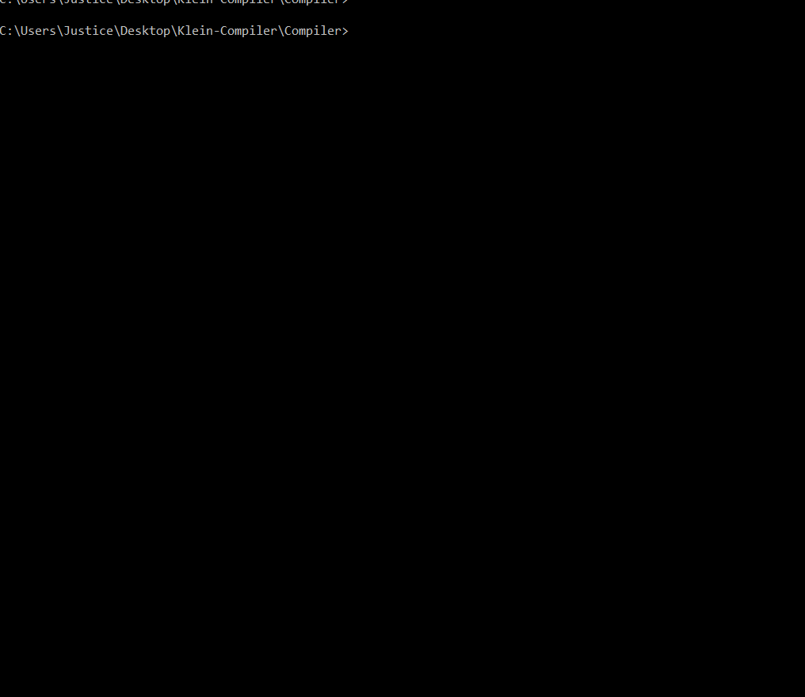

## The Project
This project was for a senior level CS project course at the University of Northern Iowa. Here you will find some examples of our final result! Let's dive in.

The purpose of the project was to build a fully functioning compiler which will translate from Klein (a fictional programming language) to TM machine language. Here is Klein's grammar for those who are interested. Note that in this grammar, ε (epsilon) stands for the empty string. It indicates that nothing is a legal alternative for the given grammar rule. It's also worth noting that whitespace is irrelevant in the grammar. It only aids readability for the programmer

Feel free to read some of the Klein programs in the [`/programs`](..//Compiler/programs) folder for a better understanding of the language.

TM is a machine language architecture which is really just a virtual machine written in C. The TM machine is described by Dr. Wallingford as "an architecture and instruction set complex enough to illustrate the important issues faced when writing a compiler, yet simple enough not to distract us with unnecessary details".

Here are the stages of the compiler. We built each stage individually, and thus, the project took on a very agile-like development process. This diagram may help you understand the data structures used and the decisions made when reading through the code. 

Finally, the implementation of the compiler and its entire test suite were written in C++.

## Compiling and Running Code
To run a program, you can simply compile the implementation files + Compiler.cpp and run the executable like so `cl /FeCompiler /EHsc src/Compiler.cpp src/implementation/*.cpp`. Alternatively, you can use the build scripts that are detailed on the [homepage](../README.md). Here's an example run when compiling and running a Klein program that prints the nth Fibonacci number. Read the code [here](fibonacci.kln)

Our compiler is also equipped with useful error messages. Here's an example of how the type-checker will throw an error when a type mismatch is encountered within the given Klein [program](type-error.kln) 

## Compiling and Running Test
To run our test suite, you can simply compile the implementation files + the test files and run the executable like so `cl /FeRunTest /EHsc test/*.cpp src/implementation/*.cpp`. Alternatively, you can use the `runtest` build script that is detailed on the [homepage](../README.md). Here's an example of what it looks like to run the test suite!

We decided to utilize the power of continuous integration with this project. We used both [Catch](https://github.com/catchorg/Catch2) and [Fake it](https://github.com/eranpeer/FakeIt) to write an exhaustive unit testing suite and we used [Travis CI](https://travis-ci.org/) as our continuous integration tool for testing builds/PR's For an idea of how this workflow is organized, here's a diagram !

[Travis CI diagram](ci-diagram.jpg)

As always, feel free to reach out if you have questions when browsing this repo :)
